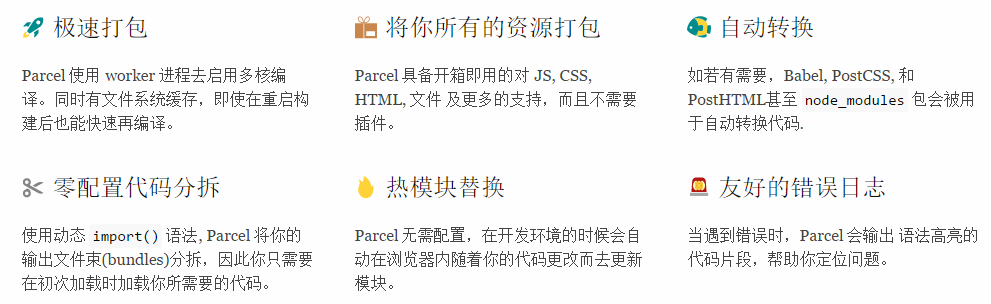

<!-- slide data-transition="zoom" -->

### 极速零配置Web应用打包工具

<!-- slide data-transition="zoom" -->

### Parcel 六大特点

<!-- slide data-transition="zoom" -->

### 比较基准

基于一个合理大小的应用程序，包含1726个模块，未压缩有6.5M 。构建在2016年的MAcBook Pro，4核物理CPU

| 打包工具        | 时间    |
| --------   | -----:   |
| browserify        | 22.98s      |
| webpack        | 20.71s      |
| parcel        | 9.98s      |
| parcel - with cache        | 2.64s      |

<!-- slide data-transition="zoom" -->

### 运作模式

- **构建资源树**

- **构建文件束（Bundle）树**

- **打包**

<!-- slide vertical=true data-transition="convex" -->

**构建资源树**：
Parcel 接受单个入口资源作为输入，可以是任意类型： JS 文件、HTML、CSS 和图片等等。有许多不同的资源类型在 Parcel 中被定义，它知道如何去处理特定的文件类型。资源会被解析，资源的依赖会被提取，资源会被转换成最终编译好的形态。此过程创建了一个资源树
<!-- slide vertical=true data-transition="convex" -->

**构建文件束（Bundle）树**： 
一旦资源树被构建好，资源会被放置在文件束树中。首先一个入口资源会被创建成一个文件束，然后动态的 import() 会被创建成子文件束 ，这引发了代码的拆分。 
当不同类型的文件资源被引入，兄弟文件束就会被创建。例如你在 JavaScript 中引入了 CSS 文件，那它会被放置在一个与 JavaScript 文件对应的兄弟文件束中。 
如果资源被多于一个文件束引用，它会被提升到文件束树中最近的公共祖先中，这样该资源就不会被多次打包。
<!-- slide vertical=true data-transition="convex" -->

**打包**： 
在文件束树被构建之后，每个文件束都会被 packager 写到一个特定文件类型的文件中。packagers 知道如何从每个资源中将代码合并起来，生成到最终被浏览器加载的文件中