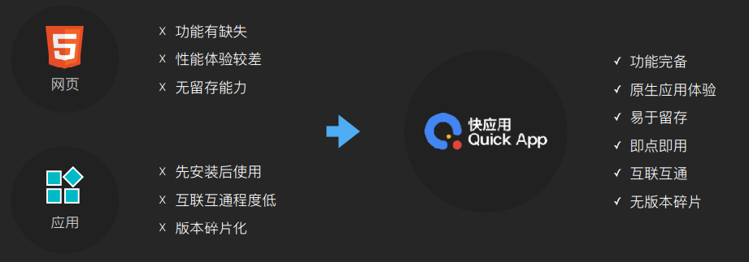
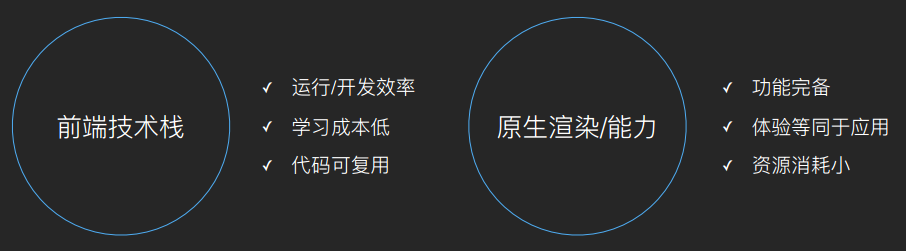
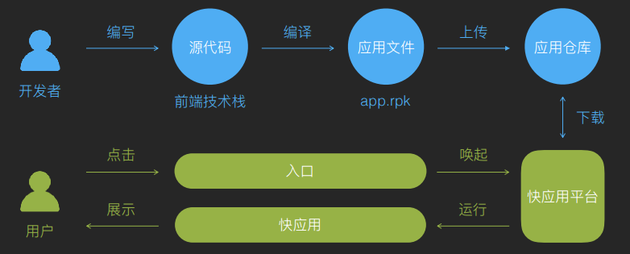
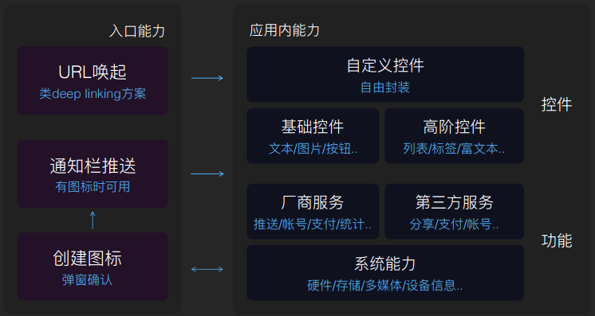
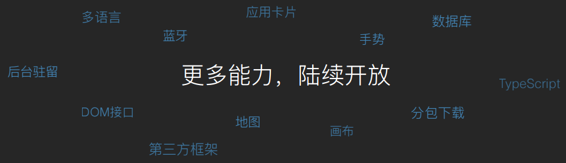
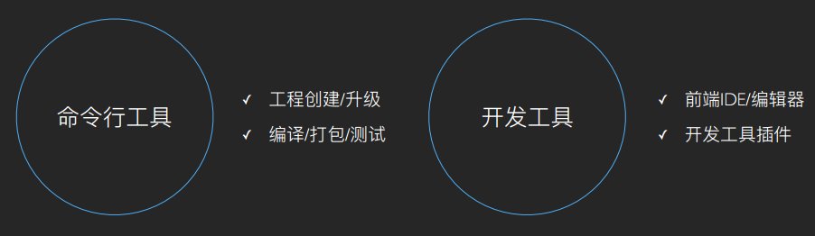
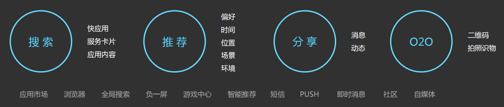
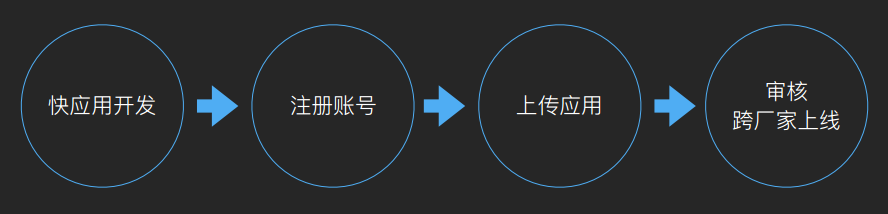

<!--  -->
<!--  -->

<!-- slide data-transition="zoom" -->

  <!-- <video src="https://swsdl.vivo.com.cn/appstore/developer/uploadfile/20180323/20180323183010837.mp4" poster="https://www.quickapp.cn/assets/images/home/video.png" controls="controls">
      您的浏览器不支持 video 标签。
  </video> -->

<!-- slide data-transition="zoom" -->
快应用是国产十大手机厂商联合制定基于手机硬件平台的新型应用形态,使用前端技术栈开发，原生渲染，同时具备 HTML 5 页面和原生应用的双重优点。用户无需下载安装，即点即用，享受原生应用的性能体验。

<!-- slide data-transition="zoom" -->
### 快应用的优势

<!-- slide data-transition="zoom" -->
### 快应用技术特点

<!-- slide data-transition="zoom" -->
### 快应用运作流程

<!-- slide vertical=true data-transition="convex" -->
代码截图展示

<!-- slide data-transition="zoom" -->
### 快应用的接口能力

<!-- slide vertical=true data-transition="convex" -->

<!-- slide data-transition="zoom" -->
### 快应用开发工具

<!-- slide vertical=true data-transition="convex" -->

<!-- slide vertical=true data-transition="convex" -->

<!-- slide data-transition="zoom" -->
### 快应用的入口

<!-- slide vertical=true data-transition="convex" -->

<!-- slide vertical=true data-transition="convex" -->

<!-- slide vertical=true data-transition="convex" -->

<!-- slide data-transition="zoom" -->
### 快应用发布流程

<!-- slide data-transition="zoom" -->
### 快应用和小程序

小程序接入广点通意味着厂商提供硬件平台的同时，从小程序获取不到利润，免费为微信打工，厂商的核心应用分发受到了威胁。

<!-- slide data-transition="zoom" -->
### 快应用和小程序
相同点：无需下载安装，即点即用、前端技术栈

不同点：快应用系统能力、原生渲染，限Android，小程序微信社交能力、webview渲染，Android、ios

快应用有点像你在街上开的一家店，小程序有点像你在大商场里面租了一个摊位，可能是这种关系。

<!-- slide data-transition="zoom" -->

<!--  -->

从小程序到快应用，安卓App市场陆续被瓜分，但目前来看不会被取代。

<!-- slide data-transition="zoom" data-background-image="https://i.loli.net/2016/07/18/578c66da6a5a3.jpg" -->
